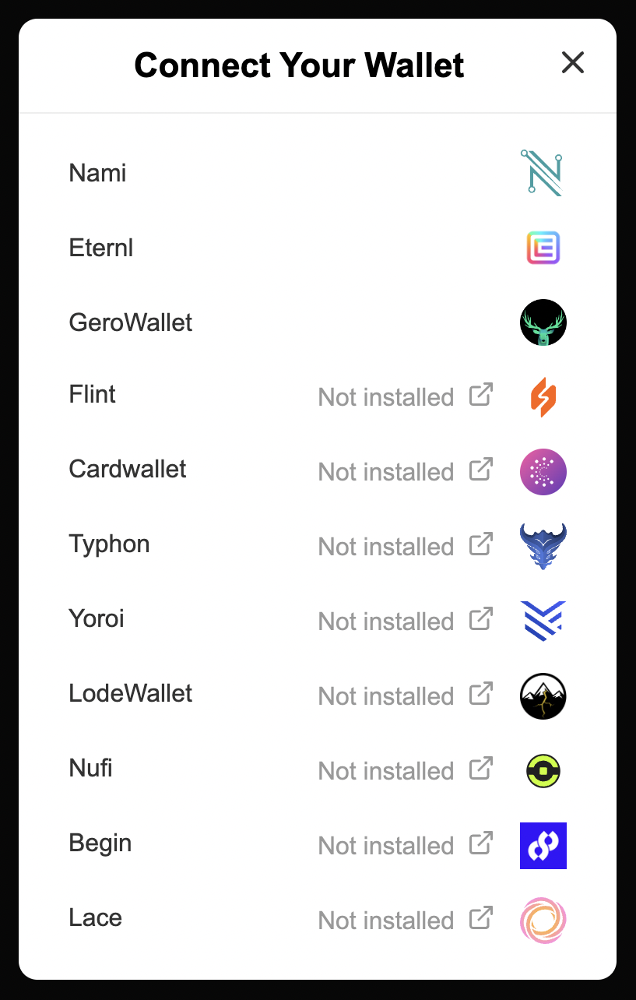
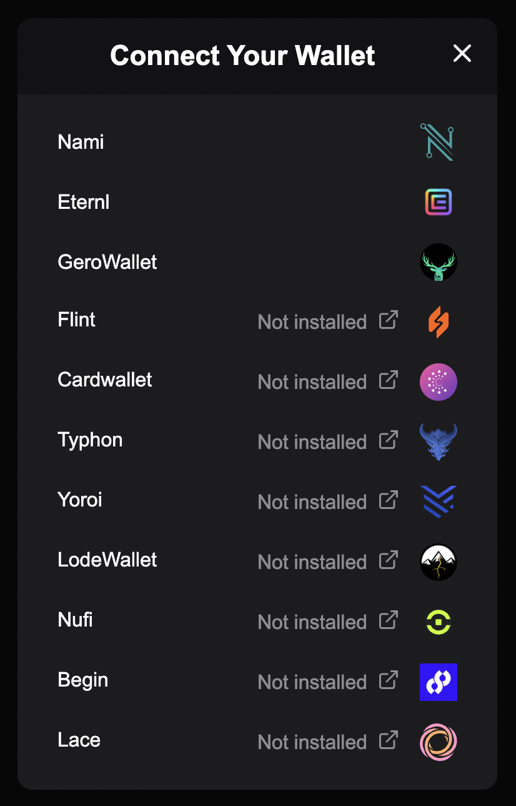

# Cardano dApp Wallet Connector

The Cardano wallet dApp connector library provides components, hooks, and util functions to simplify
utilizing the Cardano wallet object as defined in [CIP 30](https://cips.cardano.org/cips/cip30).

<center>
  <table>
    <tr>
      <td>
        
      </td>
      <td>
        
      </td>
    </tr>
  </table>
</center>

### Example

The most straightforward implemenation is to use the `ConnectWallet` component to connect a wallet
and the `useConnectWallet` hook to access it. This example will provide a button and modal to connect
a Cardano wallet, which will then be accessible with the `wallet` object returned from the hook.

```
import { FunctionComponent } from "react";
import { ConnectWallet, useConnectWallet } from "cardano-dapp-wallet-connector";

const Example: FunctionComponent = () => {
  const { wallet } = useConnectWallet();

  return (
    <ConnectWallet />
  );
}
```

## Components

### ConnectWallet

Provides a button, which brings up a modal to select and connect a wallet when clicked.

#### Props

- **`modalStyle: CSSProperties`** Inline styles for the connect wallet modal.
- **`modalHeaderStyle: CSSProperties`** Inline styles for the modal header.
- **`mainButtonStyle: CSSProperties`** Inline styles for the button used to open the connect wallet modal.
- **`disconnectButtonStyle: CSSProperties`** Inline styles for the modal disconnect button.
- **`fontFamily: string`** Font family to be used throughout the component
- **`isInverted: boolean`** True if text, icon, and hover styles should be adjusted for a dark background.
- **`onClickButton: (event: MouseEvent) => void`** Called when intial button is clicked. Defaults opening the wallet modal.
- **`onCloseModal: (event: MouseEvent) => void`** Called when modal close icon or background is clicked. Defaults to closing wallet modal.
- **`onConnect: (event: MouseEvent) => void`** Called when a wallet is connected

### WalletButton

Stand-alone connect wallet button from the `ConnectWallet` component. It can be used if you
would like to create your own modal, or have it trigger functionality other than opening the
connect wallet modal.

#### Props

- **`style: CSSProperties`** Inline styles for the button.
- **`fontFamily: string`** Font family for the button text.
- **`isInverted: booelan`** True if text styles should be adjusted for a dark background.
- **`onClick: (event: MouseEvent`** Called when the button is clicked.

### WalletModal

Stand-alone select wallet modal from the `ConnectWallet` component. It can be used if you would
like to trigger the modal with your own button or other user interaction.

#### Example

```
import { FunctionComponent, useState } from "react";
import { WalletModal } from "cardano-dapp-wallet-connector";

const Example: FunctionComponent = () => {
  const { wallet } = useConnectWallet();
  const [isModalOpen, setIsModalOpen] = useState(false);

  return (
    <>
      <MyCustomButton onClick={ () => setIsModalOpen(true) }>

      { isModalOpen && <WalletModal onClose={ () => setIsModalOpen(false) /> }
    </>
  )
}
```

#### Props

- **`style: CSSProperties`** Inline styles for the modal.
- **`headerStyle: CSSProperties`** Inline styles for the modal header.
- **`disconnectButtonStyle: CSSProperties`** Inline styles for the disconnect button.
- **`fontFamily: string`** Font family for the button text.
- **`isInverted: boolean`** True if text, icon, and hover styles should be adjusted for a dark background.
- **`onClose: (event: MouseEvent) => void`** Called when the modal modal background or close button is clicked.

## Hooks

### useConnectWallet

The `useConnectWallet` hook returns an object with the CIP 30 wallet object and
a number of helper functions.

**`wallet: Wallet | undefined`**

The "Wallet" is an object as defined in [CIP 30](https://cips.cardano.org/cips/cip30).
If the wallet has not been connected yet, it will be undefined.

**`connect: (id: string) => undefined`**

Sets the `wallet` value for the provided wallet id.

**`disconnect: () => undefined`**

Disconnects the currently connected wallet and sets the `wallet` value to `undefined`.

**`getSupportedWallets: () => Array<WalletInfo>`**

Returns an array of "WalletInfo" objects for Cardano wallet browser extensions.

The "WalletInfo" is an object with the following fields:

- `id: string` String identifier for the wallet
- `name: string` Display name for the wallet
- `icon: string` Path to the icon file
- `extensionUrl: string` Url for the wallet's browser extension
- `websiteUrl: string` Url for the wallet's website
- `isInstalled` True if the wallet browser extension has been installed

**`getBalance: (callback: (balance: number) => undefined) => undefined`**

Function that accepts a callback with the current ADA balance as
the argument.

**`getAddress: (callback: (address: string) => undefined) => undefined`**

Function that accepts a callback with a usable recieving address as
the argument.

**`isLoading: boolean`**

`true` if the wallet is currently loading (connecting, fetching balance, etc...).

**`error: string | undefined`**

An error message returned from the Cardano wallet, if one exists.

## Utils

In order to allow the library functionality to be used outside of a component, the following
functions can also be imported as utils:

**`disconnectWallet: () => void`**

Disconnects the currently connected wallet.

**`enableWallet: async (walletId: string) => Promise<Wallet>`**

Asynchronous function that connects the wallet corresponding to the provided wallet ID. Returns
a wallet object as defined in [CIP 30](https://cips.cardano.org/cips/cip30).

**`getEnabledWallet: async () => Promise<Wallet | undefined>`**

Asynchronous function that returns the currently connected wallet (as defined
in [CIP 30](https://cips.cardano.org/cips/cip30)) or `undefined` if one is not connected.

**`getSupportedWallets: () => Array<WalletInfo>`**

Returns an array of "WalletInfo" objects for Cardano wallet browser extensions.

**`getWalletAddress: async (wallet: Wallet) => Promise<string>`**

Returns a plain text wallet address from the provided wallet object.

**`getWalletBalance: async (wallet: Wallet) => Promise<number>`**

Returns the balance for the provided wallet in ADA.

## Roadmap

- Improved customization
- Additional components

Please let us know if you are a developer and would like to contribute to the package or if you
have an idea for additional functionality. Thanks!
